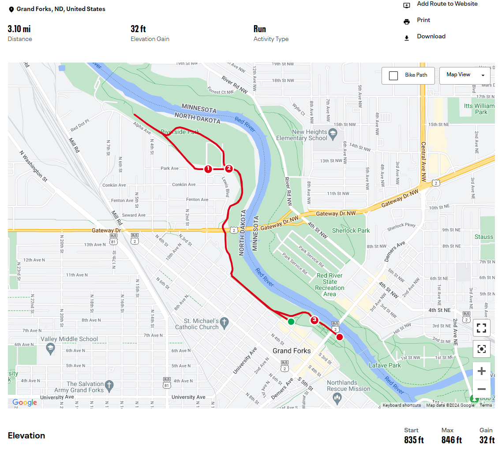
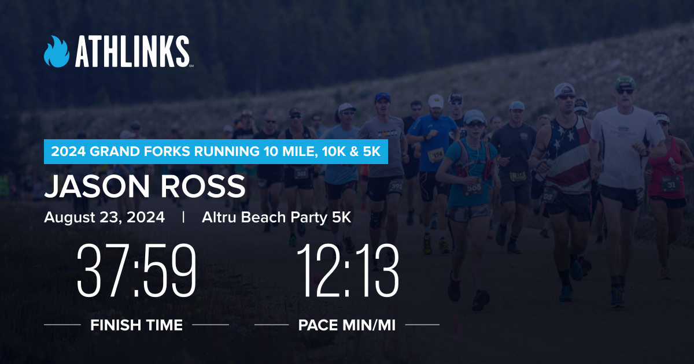
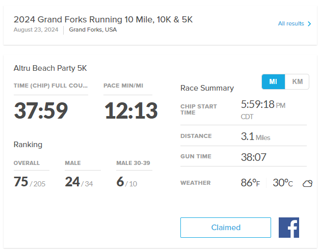
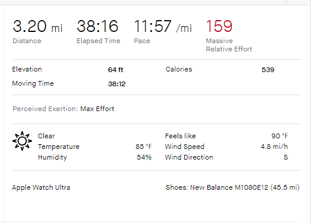
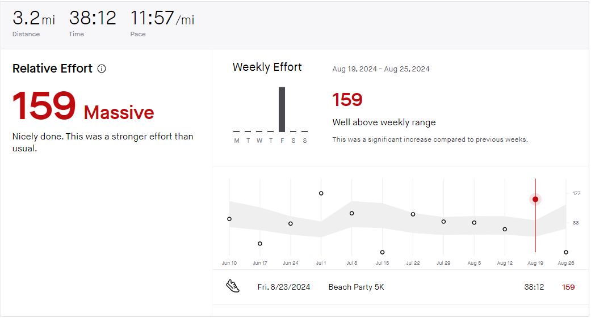
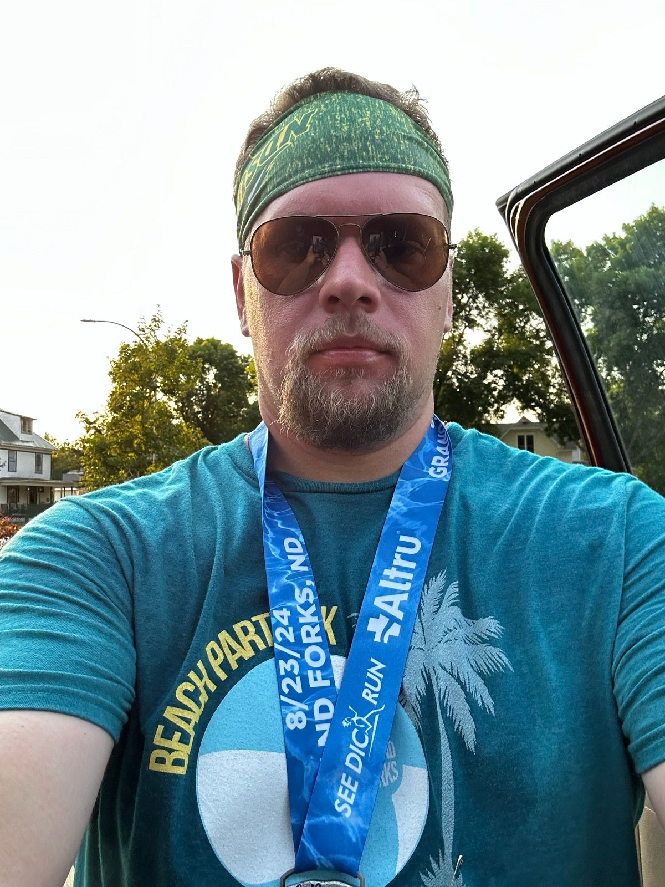
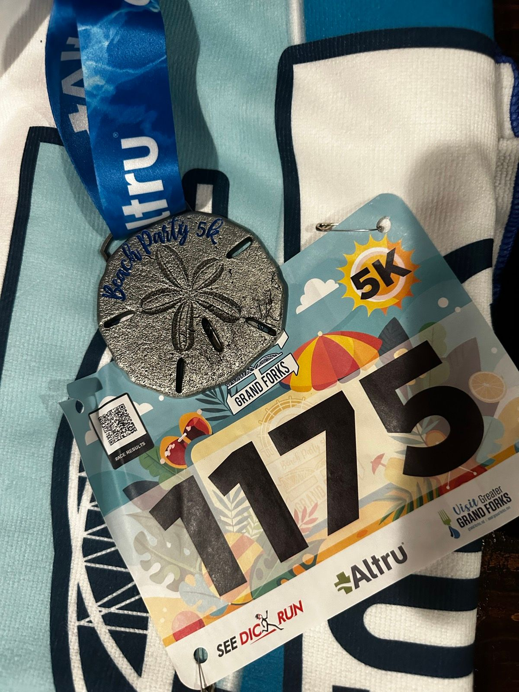

## Overview

This past weekend on Aug 23rd, 2024, I participated in the Altru Beach Party 5k in Grand Forks, ND organized by GF Running. I thought the event was well organized and they put together a great race. The Grand Forks fire department was out there with their ladder truck raising the American flag while the national anthem being sang. They also had Dakotah Lindwurm out there who just completed in the 2024 Paris Olympics as a marathoner. It was definitely a warm day, and it took some work to cross the finish line.

They had 3 different starts for the 5k:

1. First wave: Those looking to run competitively
2. Second wave: Fun course with obstacles
3. Third wave: BIO girls run

I ran the first wave since I wasn't interested in doing obstacles along the way. The University of North Dakota (UND) cheerleaders were cheering along the way, and they did have a water station about halfway through the course.

## Course Map

Below is the course map. The route was in downtown Grand Forks, ND and we ran along the Red River. Just a few blocks over, Grand Forks was having their street fair so there were many people downtown. The start and finish line were in separate locations. The green dot below is the starting line, and the red dot is the finish line.

## Official Time and Stats

My official finish time was 37:59 with a pace min/mi of 12:13. It wasn't by far my best time, but it was also hot out and I had put in a full day of work and my nutrition that day wasn't the best either.

## Strava Stats

I did not finish my run on my Apple Watch immediately after crossing the finish line, so the times below are going to be a little off compared to my official time above.

I definitely had a higher relative effort then past runs:

## Closing Thoughts

This race has the best metals so far this year. Hard to tell by the photo by they you can feel it has good quality by the weight and we also received a beach towel to match the theme of the event:

The only big issue I had was when the path split off into two paths and there were volunteers helping the runners which way to go. The volunteer pointed right but I later found out that I had to go left. I wasn't off course very long as I soon realized all the other runners went left so I had to go down 3 flights of stairs to get back on course just before the finish line. Maybe she didn't line my North Dakota State University (NDSU) headband I had on since Grand Forks is University of North Dakota (UND). I guess I will never know... 🤔

## Video Finish Line

`vimeo: https://vimeo.com/1002770651`
