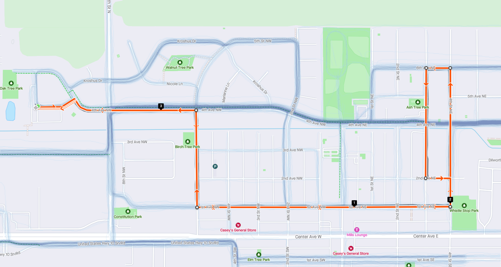
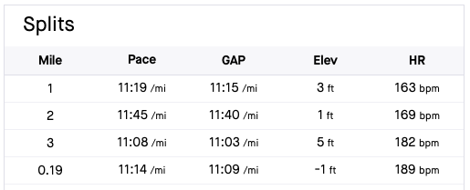
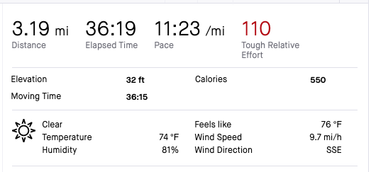

I participated in the Caboose on the Loose 5k which is part of the Dilworth, MN Loco Daze events. The 5k started at 1125 Oakview Dr, Dilworth, MN which is home of Serenity Assisted Living. The kids quarter mile fun run started at 8:00 AM and the 5k started at 8:30 AM. The BIO Girls also attended the event and they looked to have a great time. It was mentioned that the BIO Girls were training 11 weeks to run in this event. Below is the map of the run:

The weather was 75 degrees with 79% humidity. Traffic was no an issue and the Dilworth police were stopping traffic on highway 9 to let us runners run through without stopping. There were spectators throughout the entire run cheering everyone on which was great.

My split times:

Total distance and average pace per mile:

This was my second fastest 5k time that I sent for my personal record.
