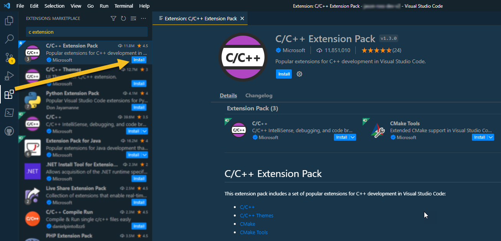
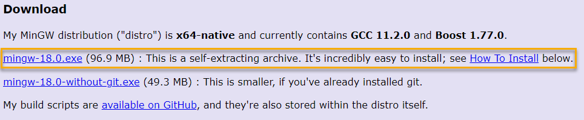
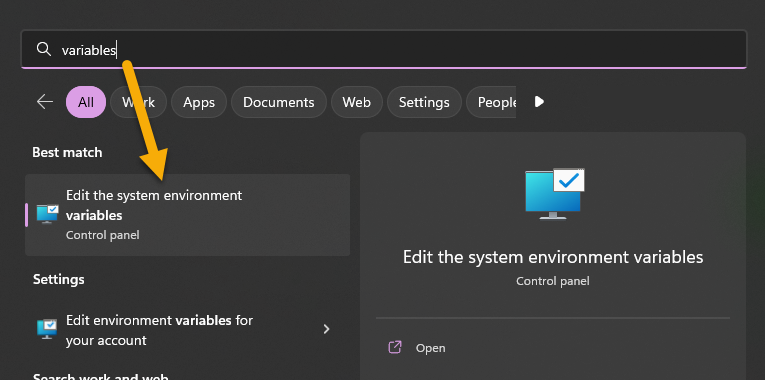
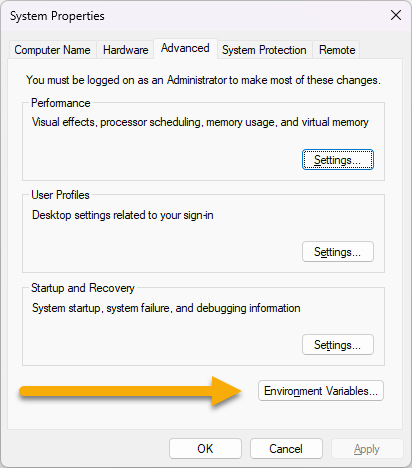
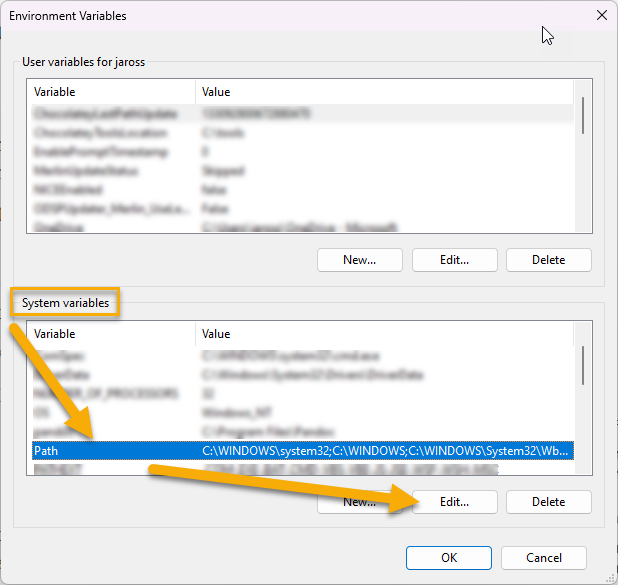
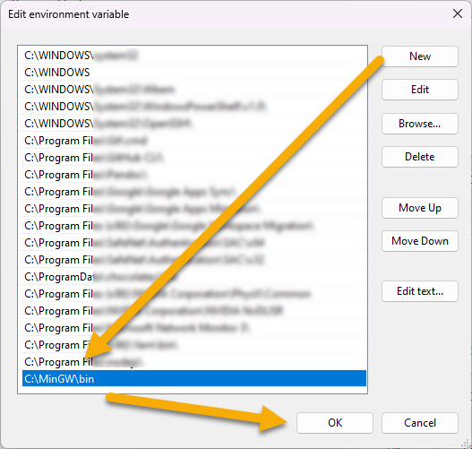
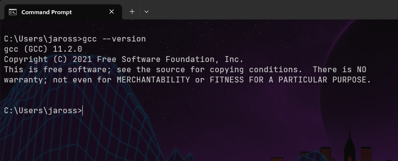
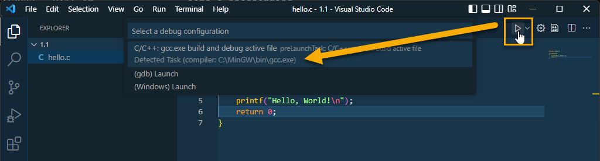
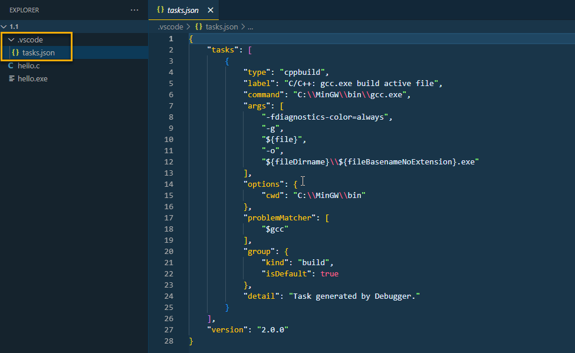

## Overview

A quick article on installing the C/C++ Extension Pack in VS Code as well as installing the MinGW in Windows which includes the GCC compiler.

## Configure VS Code

Download and install the C/C++ Extension Pack in Visual Studio Code

1. Open VS Code
2. Click Extensions
3. Search for 'c extension'
4. Click Install next to C/C++ Extension Pack



## Download the Compiler

1. Browse to https://nuwen.net/mingw.html
2. Download the Windows Mingw-w64 executable



3. Double-click mingw-XX.X.exe to start the extraction
4. I am going to extract to my C drive `C:\`
5. This will create a folder called `MinGW` on your C drive

## Set the MinGW Environment Variable

1. Go to the MinGW bin folder and copy the path. Mine looks like this: `C:\MinGW\bin`
2. On Windows 11, click the Start Button and search for variables



3. Click the Environment Variables... button



4. Under System Variables, select path, and click on Edit...



5. Click on the New button and type our MinGW bin path: `C:\MinGW\bin`



6. Click OK to save changes and close out of the other dialog boxe(s)
7. Confirm that the environment variable has been successfully added by opening a new Command Prompt and type `gcc --version` and you should get output



8. Restart VS Code if it was open during the install of MinGW and modifying the system environment variables.

## Compile your C program in VS Code

1. Copy and Paste the following code into a file called `hello.c`

```c
#include <stdio.h>

int main(void)
{
    printf("Hello, World!\n");
    return 0;
}
```

2. Save the file
3. Click the Run arrow button in the top right corner
4. Select gcc.exe which should be located in our MinGW\bin location:



5. In the Terminal output, you will see Hello, World!

You will also notice that you will see a folder get created in the same directly called .vscode that contains a file called tasks.json. This file contains the settings for our compiler:



That is all and happy coding!