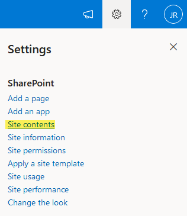
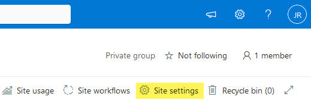
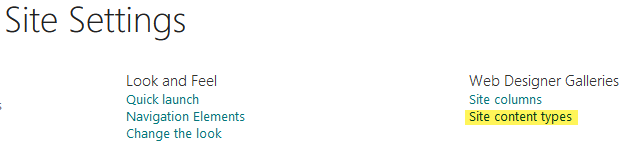
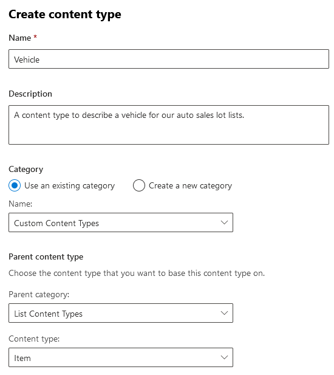
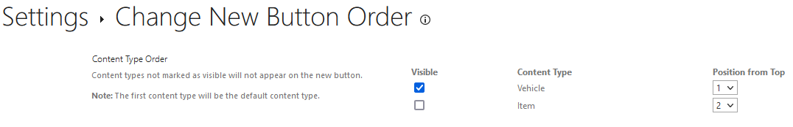

## Overview

Content Types in SharePoint are a collection of columns to describe a piece of data that can be reused across lists within a site collection. A Content Type can also be published to other site collections through the Content Type Gallery.

Content Types are useful when you have different lists that describe the same thing. For example, if you have 15 lists that are associated to a vehicle, you wouldn't want to create 10 columns (make, model, miles, MPG, color) on 15 different lists. That would be painful!

Instead, create a content type with the metadata columns that describe the vehicle such as the make, model, miles, MPG, color etc. then deploy the content type to the 15 lists. The best part is if you want to later add another column such as "condition", create that column in the Content Type and it will push down to the lists who are consuming the vehicle content type.

## Creating Example Lists

To demonstrate deploying a Content Type to several lists, I must first create a few tests lists. In this example I am going to create the following lists:

```text
Car-Sales-Lot-North
Car-Sales-Lot-South
Car-Sales-Lot-East
Car-Sales-Lot-West
```

If you haven't figured it out yet, we are pretending to sell vehicles and we have 4 auto sales lots.

## Creating a Site Content Type

We need to create our Content Type at the Site level and below are the steps to get to Site Content Types on a Modern Team Site in SharePoint:

1. Gear Icon (top right)
2. Site Contents
    
3. Site Settings
    
4. Site Content Types under the Web Designer Galleries heading
    
5. Create Content Type
6. I am creating a Vehicle content type with the following:
    
7. Click Save
8. Create the following columns in the Content Type:

| Name      	| Description                                 	|       Category 	| Select from column type 	| Default value 	|
|-----------	|---------------------------------------------	|---------------:	|-------------------------	|---------------	|
| Title     	|                                             	| Custom Columns 	| Single line of text     	|               	|
| Make      	| Manufacturer                                	| Custom Columns 	| Single line of text     	|               	|
| Model     	|                                             	| Custom Columns 	| Single line of text     	|               	|
| Milage    	| How many miles are currently on the vehicle 	| Custom Columns 	| Number                  	|               	|
| Color     	| Red, Blue, White, Black, Etc                	| Custom Columns 	| Dropdown                	|               	|
| Condition 	| New, Used or Salvage Title                  	| Custom Columns 	| Choice                  	|               	|
| Sold      	| Indicate if vehicle is sold or not          	| Custom Columns 	| Yes/No                  	| No            	|

## Allowing Management of Content Types on the Lists

Next we need to go to each one of our Lists and allow management of Content Types. Below are the steps we will take for each of the 4 lsits we provisioned:

1. Browse to the List
2. Gear Icon (top right)
3. List Settings
4. Advanced Settings
5. Set "Allow management of content types" to Yes
6. OK
7. Repeat for all 4 Lists

## Adding our Content Type to the list

After we enabled allow management of content types, under list settings there is now a Content Types section. Click "Add from existing site content types" and search for the "Vehicle" content type > Add > OK.

After we clicked OK we are now back in list settings. Under the "Content Types" heading, click "Change new button order and default content types". We will unselect Item and only keep Vehicle selected.



Do this for all 4 lists.

## Conclusion

Test this out by clicking on the New button in your lists and you will be prompted to fill out information about a Vehicle. All you need to do next is configure your views on what information you want to show per list. If you need to add metadata to the Content Type, by default it will push that new column down to all the lists consuming that content type.