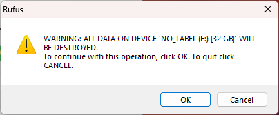

These steps are for anyone wanting to install Arch linux from a bootable USB flash drive and only have access to a Windows machine.

1. Download [Rufus](https://rufus.ie)
2. Download the [Arch Linux](https://archlinux.org) iso
3. Insert a USB drive that can be overwritten
4. Open the Rufus executable
5. Device = You USB flash drive
6. Boot selection = Click SELECT and browse to the Arch Linux iso image you downloaded
7. Click Start

8. Keep Write in "ISO Image mode (Recommended) and click OK.

9. Click YES, to download the newest version of Syslinux

10. You will be warned about all data on the USB flash drive will be erased. Click OK if you have made sure you don't need the existing data.

11. Wait for the ISO files to be copied

12. Once the copy is complete, the status will say Ready. Click on CLOSE and safely remove the USB drive from your machine.