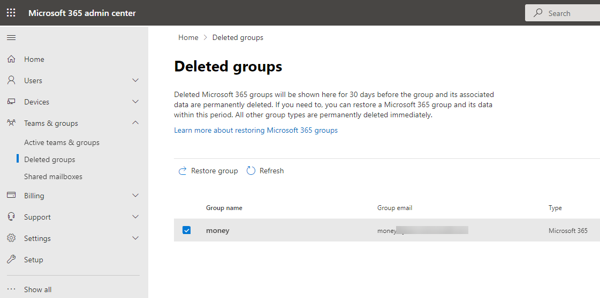
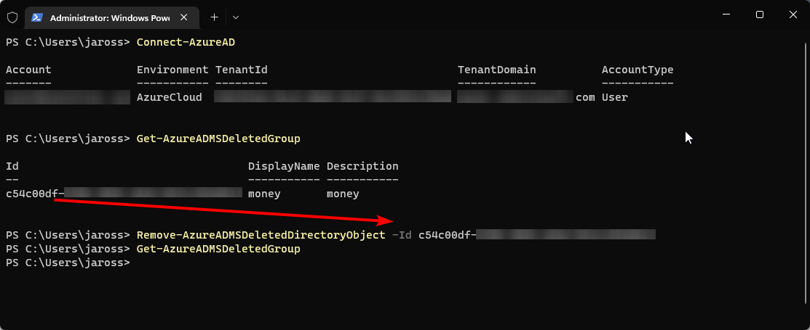
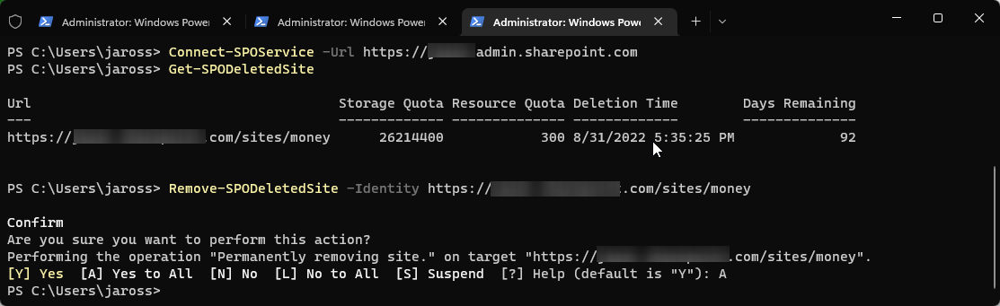

## Scenario

I had a SharePoint site with the URL of https://myTenant.sharepoint.com/sites/money. I decided to delete the Money site and re-create it from scratch. The Money site is part of an Office 365 group. I logged into the SharePoint Online Admin Center and deleted the Money site. However, I still could not delete the Money site because it still exists in the Site Collection Recycle bin and there is no way to delete the site from the recycle bin. I then went to the Microsoft 365 Admin Center and I do not have an option to delete the group from the deleted groups page. Below are the steps I took to delete both the Group and Site:



## Using PowerShell

```PowerShell
Install-Module AzureAD

Connect-AzureAD

Get-AzureADMSDeletedGroup

Remove-AzureADMSDeletedDirectoryObject -Id <ID>
```



Now that they associated group is deleted, we can now delete the SharePoint site from the Recycle Bin:

```PowerShell
Connect-SPOService -Url https://myTenant-admin.sharepoint.com

Get-SPODeletedSite

Remove-SPODeletedSite -Identity https://myTenant.sharepoint.com/sites/money
```

