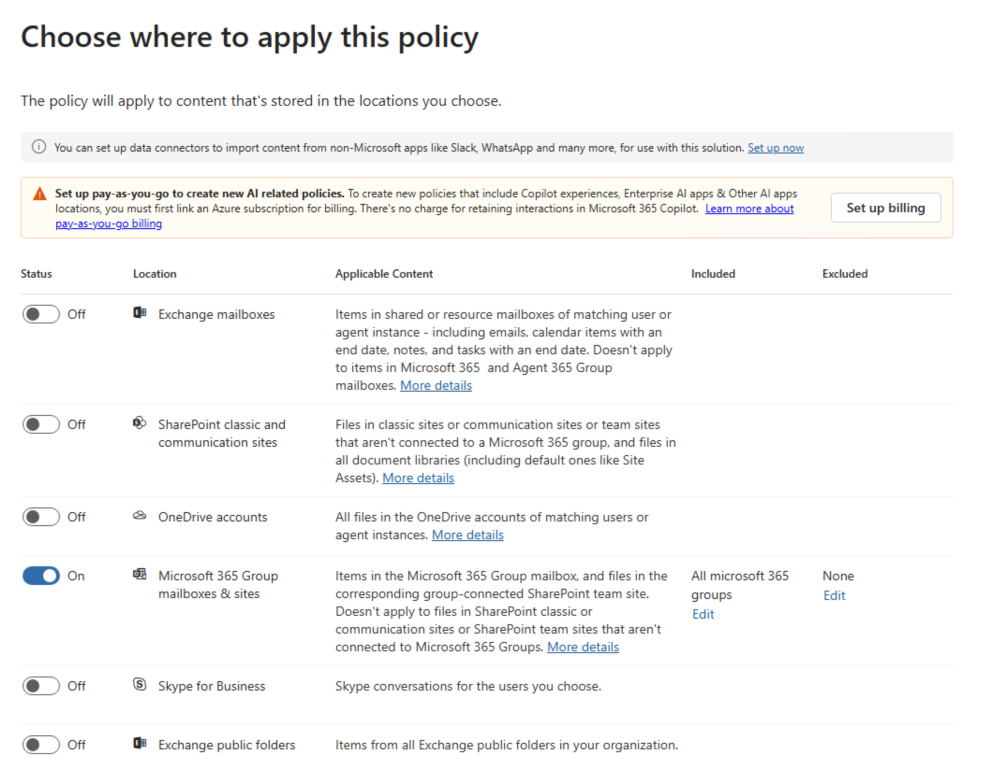
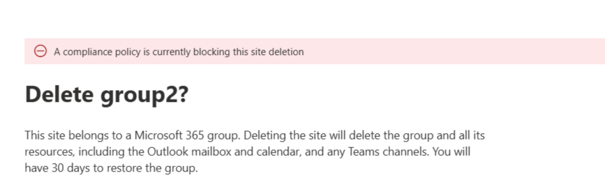

## Scenario

In some Microsoft 365 environments, you may run into an issue where a SharePoint site cannot be deleted because it is still governed by a retention policy—even if the Microsoft 365 Group the site belonged to has already been deleted.

This happens when a retention policy in Microsoft Purview is scoped to Microsoft 365 Group mailboxes and sites. Deleting the M365 group does not remove the associated site if the policy is still in effect. In this article, I'll walk through how to remove the SharePoint site by temporarily adding it to the policy's exception list using PowerShell. But first, we are going to recreate the scenario.

Below is an example of the retention policy I had configured in Microsoft Purview under Data Lifecycle Management. The policy applies to M365 Group Mailboxes & Sites, with the following settings:




After creating a new Microsoft 365 group (which automatically creates its SharePoint site), I waited some time for the policy to be applied. I then deleted the group from the Microsoft 365 Admin Center. For demonstration purposes, we can also assume the group has been deleted for over 30 days and is no longer recoverable.

I went ahead and force removed the group from the recycle bin to mimic what someone help might be dealing with:

```powershell
Install-Module AzureAD

Connect-AzureAD

Get-AzureADMSDeletedGroup

Remove-AzureADMSDeletedDirectoryObject -Id <ID>
```

At this point, the group was fully deleted—but its SharePoint site remained. Because the site was still under the retention policy, SharePoint refused to delete it.

When attempting to delete the site from the SharePoint Admin Center, the following message appeared:



Trying again from:

`https://mytenant.sharepoint.com/sites/mygroup/_layouts/15/deleteweb.aspx`

resulted in:

Sorry, something went wrong
We can't delete this site. This site is included in a compliance policy that's preventing its deletion. Try deleting the site again after excluding it from 42c6fff7-a21b-4df6-b378-835095b3e22f. For more information please check aka.ms/compliance-policy-blocking-site-deletion

## Solution

To remove the site, we'll identify the site's ID, find the retention policy that is blocking deletion, and add the site to that policy's Modern Group location exception list using PowerShell.

### Find the Site ID

First, retrieve the Site ID. We'll need this value later when adding it to the exception list.

```powershell
Connect-SPOService -Url https://myTenant-admin.sharepoint.com

$site = Get-SPOSite -Identity https://myTenant.sharepoint.com/sites/group2

$site.SiteId

Guid
----
d94dac4e-16ba-43fe-85d1-8083155e7221
```

### Find the Policy Name and ID

Next, list all retention policies so you can identify which one is preventing the site deletion.

```powershell
$policies = Get-RetentionCompliancePolicy

$policies | Format-Table Name, Guid, Enabled, Mode, Workload

Name                      Guid                                 Enabled Mode    Workload
----                      ----                                 ------- ----    --------
Test Group Policy         42c6fff7-a21b-4df6-b378-835095b3e22f    True Enforce Exchange, SharePoint, OneDriveForBusiness, Skype, ModernGroup, DynamicScope
GDPR Policy               0b00e30d-7b74-462d-814a-a0dcd78a6c16    True Enforce Exchange, SharePoint, OneDriveForBusiness, Skype, ModernGroup, DynamicScope
Test Policy               65ab43af-ee53-47ac-a796-aac8934c94f4    True Enforce Exchange, SharePoint, OneDriveForBusiness, Skype, ModernGroup, DynamicScope
OneDrive Retention Policy 8fc7363e-bce5-4844-a576-fa92a3bd13a4    True Enforce Exchange, SharePoint, OneDriveForBusiness, Skype, ModernGroup, DynamicScope
```

This will show all policies along with their GUIDs. Note the GUID of the policy listed in the SharePoint error message.

### Add the Site to the Modern Group Exceptions List

With the policy ID and site details in hand, add the site to the exception list so it can be deleted.

```powershell
Import-Module ExchangeOnlineManagement

Connect-IPPSSession -UserPrincipalName admin@myTenant.onmicrosoft.com

$stringJson = @"
[{
     'EmailAddress': 'group2@myTenant.onmicrosoft.com',
     'SiteId': 'd94dac4e-16ba-43fe-85d1-8083155e7221'
}]
"@

Set-RetentionCompliancePolicy -Identity 42c6fff7-a21b-4df6-b378-835095b3e22f -AddModernGroupLocationException "group2@myTenant.onmicrosoft.com" -DeletedResources $stringJson
```

Once the exception is added, you should be able to successfully delete the SharePoint site from the Admin Center or directly via the deleteweb.aspx page.