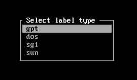
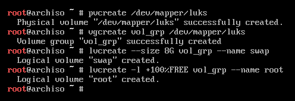
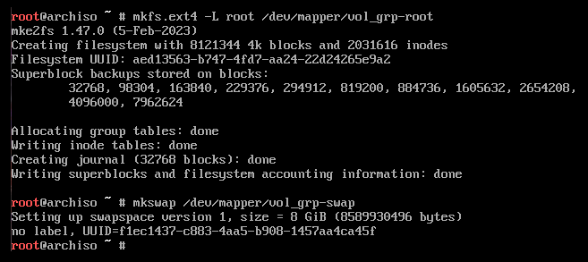

This is a more recent article I put together on how to install Arch linux with EUFI on a Lenovo ThinkPad T470p with secure boot disabled. This article assumes you are using a US keyboard layout. You should also read the official Arch installation guide https://wiki.archlinux.org/index.php/installation_guide.

My ThinkPad uses a NVMe (Non-Volatile Memory Express) storage interface drive. I call this out because you will see my notes referencing `/dev/nvme0n1` in the notes below.

1. Verify boot mode:
    - This is an important set when working with a UEFI system. Run the below command and if the directory does not exist, the system may not be booted in UEFI mode.
    - `ls /sys/firmware/efi/efivars` (If the directory exist your computer supports EFI)

2. Ping some site on the internet to verify connection:
    - Use `ip link` to verify your network devices
    - If necessary, use `iwctl` to setup your wireless
    - Run `ping` to check to see if you already have an internet connection
    - `ping archlinux.org -c 5`

3. Update system clock:
    - View the current status of your clock by running `timedatectl status`
    - Run the following command to ensure your system clock is correct `timedatectl set-ntp true`
    - This will set your date and time to update remotely using network time protocol

4. Go to [https://archlinux.org/mirrorlist](https://archlinux.org/mirrorlist) and find the closest mirror that supports HTTPS:
    - Add the mirrors on top of the `/etc/pacman.d/mirrorlist` file.
    - `Server = https://mirror.arizona.edu/archlinux/$repo/os/$arch` (United States)

5. Run `fdisk -l` to show you disks

6. `cfdisk -z /dev/the_disk_to_be_partitioned` in my case it would be `cfdisk -z /dev/nvme0n1`

7. Select `gpt`



8. Create EFI partition:
    - New
    - 1G
    - Type
    - EFI System
    - Write

9. Create root partition:
    - Select free space
    - New
    - Use rest of the space
    - Linux root (x86-64) filesystem
    - Write

10. Create the filesystems and encryption:
    - `fdisk -l` to view the partitions for the next step
    - `mkfs.vfat -F32 -n EFI /dev/nvme0n1p1`
    - `cryptsetup --use-random luksFormat /dev/nvme0n1p2` (you will be prompted to type a passphrase)
    - `cryptsetup luksOpen /dev/nvme0n1p2 luks`

11. Create logical partitions
    - `pvcreate /dev/mapper/luks`
    - `vgcreate vol_grp /dev/mapper/luks`
    - `lvcreate --size 8G vol_grp --name swap`
    - `lvcreate -l +100%FREE vol_grp --name root`



12. Format the root and swap partitions
    - `mkfs.ext4 -L root /dev/mapper/vol_grp-root`
    - `mkswap /dev/mapper/vol_grp-swap`



13. Mount the filesystems.
    - `mount /dev/mapper/vol_grp-root /mnt`
    - `swapon /dev/mapper/vol_grp-swap`
    - `mount --mkdir /dev/nvme0n1p1 /mnt/boot`

14. Install Arch linux base packages:
    - Use the following if you want to include VIM:
    - `pacstrap -K /mnt base base-devel linux linux-firmware sudo lvm2 efibootmgr intel-ucode xf86-video-intel vi vim`

15. Generate the `/etc/fstab` file:
    - `genfstab -U /mnt >> /mnt/etc/fstab`

16. Chroot into installed system:
    - `arch-chroot /mnt`

17. Set the timezone:
    - `ln -sf /usr/share/zoneinfo/America/Chicago /etc/localtime`

18. Update the Hardware clock:
    - `hwclock --systohc`

19. Set locale:
    - `sed -i 's/#en_US.UTF-8/en_US.UTF-8/g' /etc/locale.gen` (uncomment en_US.UTF-8)
    - or `vim /etc/locale.gen` and manually uncomment en_US.UTF-8
    - `locale-gen`

20. Set your hostname and configure hosts
    - `echo myhostname > /etc/hostname`
    - Update `/etc/hosts` with the following:

    ```text
    127.0.0.1	localhost
    ::1		localhost
    127.0.1.1	myhostname.localdomain	myhostname
    ```

21. Set the root password
    - `passwd`

22. Let's enable the network
    - If you don't do this before your reboot you won't have internet connection
    - `pacman -S networkmanager`
    - `systemctl enable NetworkManager`

23. Create the initial ramdisk environment
    - `vim /etc/mkinitcpio.conf`

    Update mkinitcpio.conf to the values below:

    ```text
    MODULES=(ext4)
    BINARIES=()
    FILES=()
    HOOKS=(base udev autodetect modconf block encrypt lvm2 resume filesystems keyboard fsck)
    ```

    ```bash
    - `mkinitcpio -p linux`
    - `bootctl --path=/boot install`
    ```

24. Boot loader settings
    - `echo default archlinux >> /boot/loader/loader.conf`
    - `echo timeout 4 >> /boot/loader/loader.conf`

25. Find the UUID of encrypted partition using `blkid`
    - `blkid`
    `vim /boot/loader/entries/archlinux.conf`

    Then enter the following information:

    ```text
    title Arch Linux
    linux /vmlinuz-linux
    initrd /intel-ucode.img
    initrd /initramfs-linux.img
    options cryptdevice=UUID="YOUR-UUID-HERE":vol_grp root=/dev/mapper/vol_grp-root resume=/dev/mapper/vol_grp-swap rw intel_pstate=no_hwp
    ```

26. Exit, unount and reboot:
    - `exit`
    - `umount -R /mnt`
    - `reboot`

27. Install `throttled` which is a workaround for Intel throttling issues. Read more about it [here](https://github.com/erpalma/throttled).
    - `pacman -S throttled`
    - `sudo systemctl enable --now throttled.service`

Thanks for visiting!
