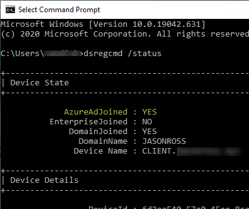
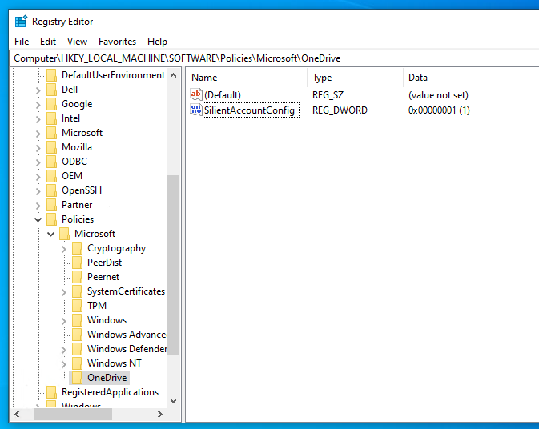
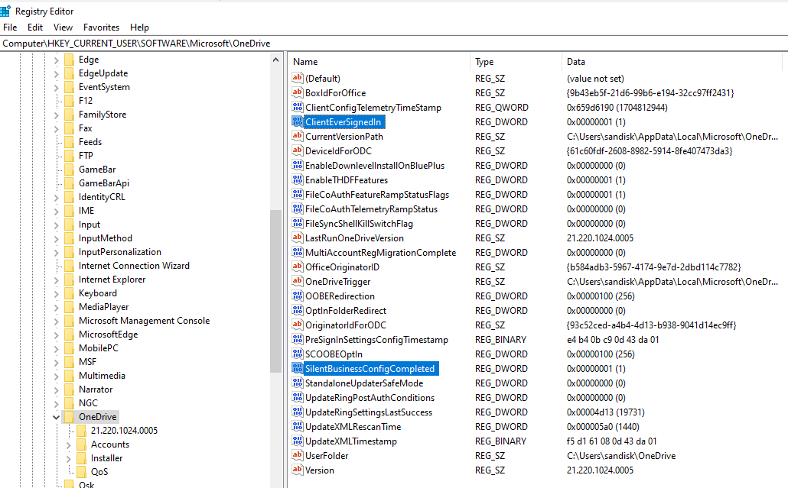

## Overview

In this article I will show you the steps to turn on Silent Account Config for OneDrive for Business. Silent Account Config can be pushed down through a Group Policy from Active Directory or can be enabled with a registry key. Once Silent Account Config is enabled, OneDrive will automatically sign-in in the background without the end user having to enter their credentials. The official article on how to set this up can be found [here](https://learn.microsoft.com/en-us/sharepoint/use-silent-account-configuration).

## Prerequisites

- The machine has to be Microsoft Entra ID joined
- The user needs to sign-in with their work or school account in Windows
- The client machine would have to have 1GB of free space. The OneDrive Sync Client will perform a check to ensure that it wouldn't cause the disk space to drop below 1 GB.
- The OS needs to be Windows 11, 10, Server 2019, Server 2016 or Server 2012 R2

## Microsoft Entra ID Joined

Check to see if the client machine is Microsoft Entra ID joined using `dsregcmd /status`. To do this, open Command Prompt and type:

```text
dsregcmd /status
```

Your device is joined to Microsoft Entra ID if you see AzureAdJoined equal YES. Below is a screenshot:



## Turning on Silent Account Config

Once you have confirmed with `dsregcmd /status` that the machine is Microsoft Entra ID joined, the next step is to turn on Silent Account Config. Since I have this turned on for a single machine, I went the registry route and created the following key: `[HKLM\SOFTWARE\Policies\Microsoft\OneDrive]"SilentAccountConfig"=dword:00000001`.



## Validating Silent Account Config Worked

Now sign out of Windows and sign back in with the work or school account and validate if OneDrive automatically signed in or not. You can also check the registry to see if Silent Account Config was successsful. OneDrive will create two registry key values in `HKEY_CURRENT_USER\SOFTWARE\Microsoft\OneDrive`. See `ClientEverSignedIn` and `SilentBusinessConfigCompleted` in the below screenshot:



## Video

Below is a video demonstration I put together:

`vimeo: https://vimeo.com/917110656`