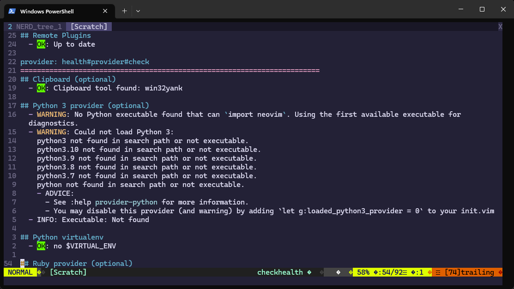
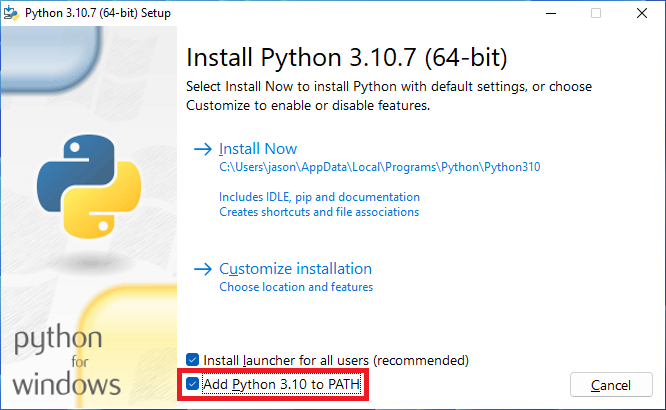
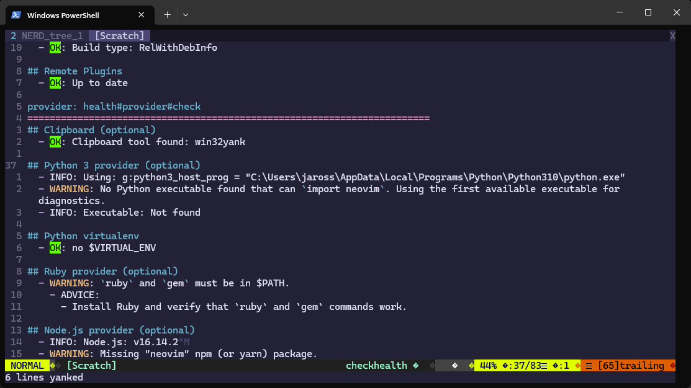

## Overview

You just downloaded and configured Vim on Windows. Upon running :healthcheck, you see warnings about not being able to find Python as seen below:



```text
## Python 3 provider (optional)
  - WARNING: No Python executable found that can `import neovim`. Using the first available executable for diagnostics.
  - WARNING: Could not load Python 3:
    python3 not found in search path or not executable.
    python3.10 not found in search path or not executable.
    python3.9 not found in search path or not executable.
    python3.8 not found in search path or not executable.
    python3.7 not found in search path or not executable.
    python not found in search path or not executable.
    - ADVICE:
      - See :help |provider-python| for more information.
      - You may disable this provider (and warning) by adding `let g:loaded_python3_provider = 0` to your init.vim
  - INFO: Executable: Not found
```

## Solution

Before we get started, I should state that I am using Neovim.

First, you need to download and install Python if you haven't already done this. During the setup, make sure to also add to select "Add Python 3.10 to PATH":



Once Python is installed, close any open PowerShell sessions and re-launch PowerShell. Open your vim init file and add the following line:

```vim
let g:python3_host_prog = 'C:\Users\<PROFILE>\AppData\Local\Programs\Python\Python310\python.exe'
```

> Make sure to replace <Profile> with your account name

If you do not know the location of your init.vim config file on Windows, it is located in ~/AppData/Local/nvim/init.vim.

Save your Vim config file and restart vim and run `:checkhealth` again. We resolved the issue of not being able to load Python 3 but we are still seeing the other warning about `import neovim`.



```text
## Python 3 provider (optional)
  - INFO: Using: g:python3_host_prog = "C:\Users\jaross\AppData\Local\Programs\Python\Python310\python.exe"
  - WARNING: No Python executable found that can `import neovim`. Using the first available executable for diagnostics.
  - INFO: Executable: Not found
```

To resolve this, open PowerShell and run the following:

```PowerShell
C:\Users\<PROFILE>\AppData\Local\Programs\Python\Python310\python.exe -m pip install pynvim
```

Close and restart Vim. Run `:checkhealth` again and you will see Python is correctly configured:

```text
## Python 3 provider (optional)
  - INFO: Using: g:python3_host_prog = "C:\Users\jason\AppData\Local\Programs\Python\Python310\python.exe"
  - INFO: Executable: C:\Users\jason\AppData\Local\Programs\Python\Python310\python.exe
  - INFO: Python version: 3.10.7
  - INFO: pynvim version: 0.4.3
  - OK: Latest pynvim is installed.
```